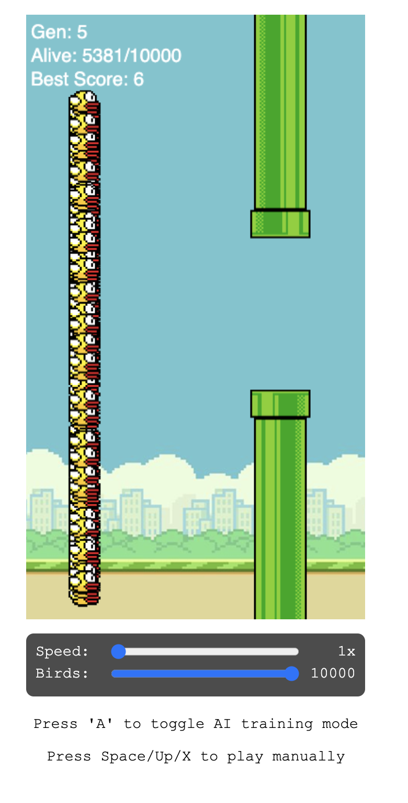
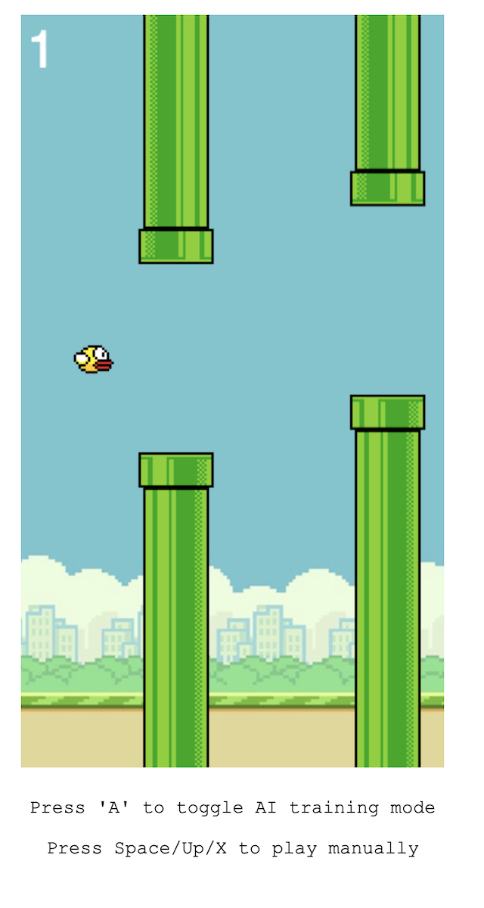

# Flappy Bird AI: Neuroevolution

This project is an implementation of the classic Flappy Bird game with a powerful twist: a self-learning AI that learns to play the game using a **Genetic Algorithm** and **Neural Networks**.

You can toggle between playing the game yourself and watching the AI train a population of birds across generations.

---

### 🎮 Features

- **Manual Play Mode:** Play the standard Flappy Bird game yourself.
- **AI Training Mode:** Press 'A' to toggle the AI mode. Watch hundreds or thousands of birds learn from scratch.
- **AI Controls:**

  - **Speed Slider:** Adjust the simulation speed from 1x to 20x to accelerate training.
  - **Population Slider:** Control the number of birds in each generation, from 10 to 10,000.

- **Live Stats:** The AI mode displays the current **Generation**, the number of **Alive** birds, and the **Best Score** achieved so far.

---

### 🧠 How the AI Works

The AI combines a Neural Network (the "brain") with a Genetic Algorithm (the "learning" process).

#### 1. The Neural Network (The "Brain")

Each bird has its own brain, which is a simple feed-forward neural network. This network takes 5 inputs from the game environment and produces 2 outputs that decide whether to flap or not.

- **Inputs (5):**

  1. Bird's Y (vertical) position
  2. Bird's vertical velocity
  3. Horizontal distance to the next pipe
  4. Y position of the top pipe
  5. Y position of the bottom pipe

- **Hidden Layer (8):** An intermediate layer of 8 nodes.

- **Outputs (2):**

  1. **"Flap" score:** A number representing the confidence to flap.
  2. **"Don't Flap" score:** A number representing the confidence to not flap.

The bird takes whichever action has the higher score.

#### 2. The Genetic Algorithm (The "Learning")

The AI learns through simulated evolution over many **generations**:

1. **Initialization:** The program starts with a large population (e.g., 100 birds) of new `AIBird` objects, each with a randomly initialized neural network brain.
2. **Run Simulation:** All birds play the game simultaneously. The `think` function is called for each bird to get its decision, and the `update` function moves the bird.
3. **Fitness Calculation:** When all birds have died, the algorithm calculates a "fitness" score for each one. This score is based on how long the bird survived (`framesAlive`) and how many pipes it passed (`score`), with passing pipes being exponentially rewarded.
4. **Selection (Reproduction):** The algorithm creates a new generation of birds.

   - **Elitism:** The single best bird from the previous generation is copied directly to the new one, preserving its "smart" brain.
   - **Selection:** For the rest of the new population, the algorithm uses "roulette wheel selection" to pick parents from the old population. Birds with higher fitness scores are more likely to be chosen.

5. **Mutation:** When a parent is selected, its brain is copied to a new "child" bird. This child's brain then undergoes **mutation**, where its neural network weights and biases are randomly adjusted by a small amount. This allows the new generation to explore new strategies.
6. **Repeat:** This cycle repeats, and over time, the birds become progressively better at navigating the pipes.

---

### 🚀 How to Run

1. Clone the repository.
2. Open the `index.html` file in any modern web browser.

### 🕹️ Controls

- **Space / Arrow Up / X:** Flap (in manual mode).
- **A:** Toggle between Manual Mode and AI Training Mode.

### 💻 Technologies Used

- **HTML5:** For the basic page structure (`index.html`).
- **CSS3:** For styling the game, sliders, and buttons (`flappybird.css`).
- **JavaScript (ES6+):**

  - `flappybird.js`: Handles all the core game logic, rendering on the HTML5 Canvas, physics, and collision detection.
  - `geneticalgorithm.js`: Contains the classes for `NeuralNetwork`, `AIBird`, and `GeneticAlgorithm`, all built from scratch.
