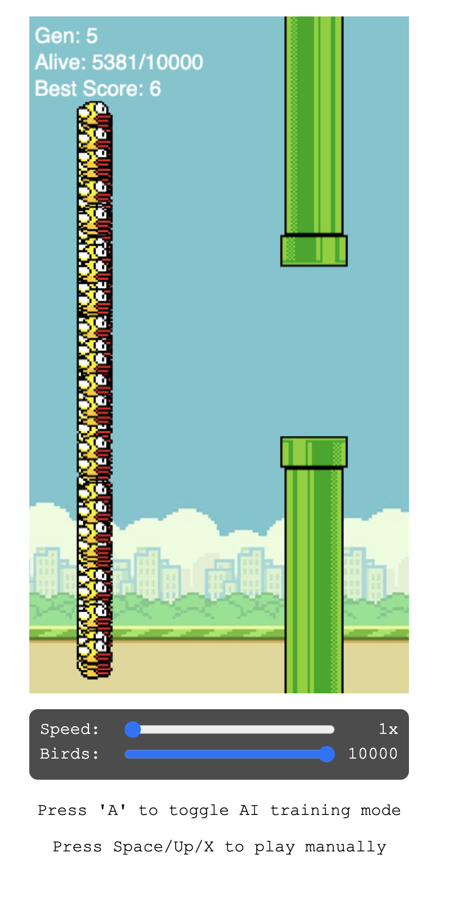
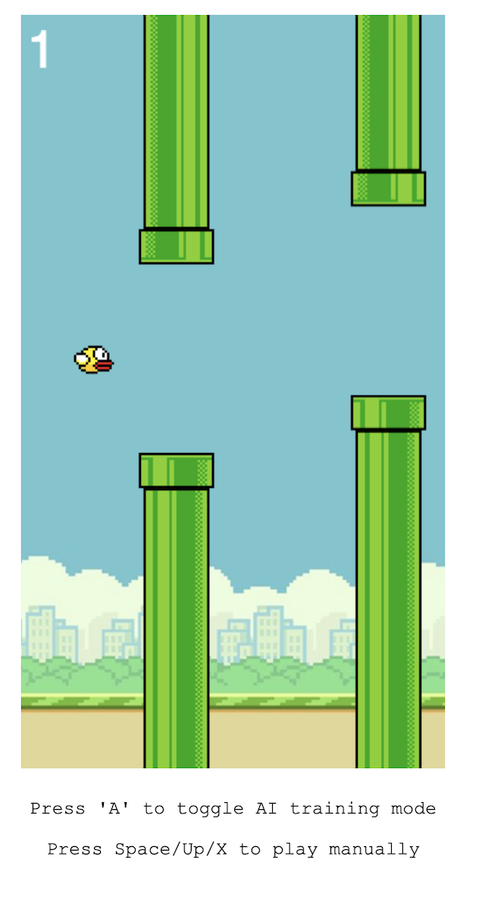
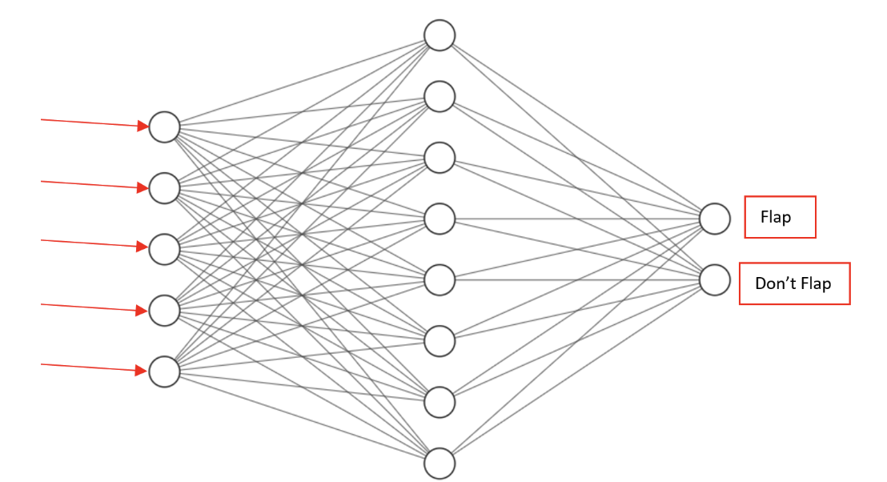
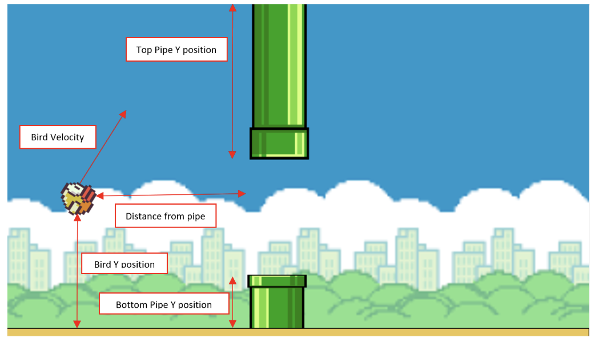

# Flappy Bird AI: Neuroevolution

This project is an implementation of the classic Flappy Bird game with a powerful twist: a self-learning AI that learns to play the game using a **Genetic Algorithm** and **Neural Networks**.

You can play the game yourself, watch a flock of up to 10,000 birds teach themselves to fly, and scroll down for an animated, step-by-step explanation of how the genetic algorithm works.

<p align="center">
  
</p>

---

### 🎮 Features

- **Manual Play Mode:** Play Flappy Bird yourself with keyboard, mouse or touch. Runs at the same speed on every display (60 Hz, 120 Hz, 144 Hz), with a get-ready screen, game-over card and a saved best score.
- **AI Training Mode:** Watch hundreds or thousands of birds learn from scratch. The live score (pipes passed by the current generation) is shown on the canvas.
- **Evolution lab:**
  - **Speed:** 1x to 100x (automatically capped at what your device can handle).
  - **Birds:** 10 to 10,000 per generation (default 500).
  - **Mutation rate:** 0% to 50%.
  - **Crossover:** mix two parents' genes per child instead of cloning one.
  - **DNA colours:** every bird is coloured by its genome, so you can watch one family take over the flock.
- **Live brain view:** the neural network of the highlighted bird, its inputs and its 66-gene DNA strip, updating in real time.
- **Score history chart:** pipes passed per generation.
- **"How it learns" explainer:** a scroll-driven motion-graphics walkthrough of one full cycle of the algorithm: senses → brain → DNA → generation → flight → fitness → roulette selection → mutation → crossover → repeat.
- **One-click experiments:** freeze mutation, crank it to chaos, train a tiny or a giant flock, toggle crossover.
- Fully responsive, from small phones to wide desktops.

<p align="center">
  
</p>

---

### 🧠 How the AI Works

The AI combines a Neural Network (the "brain") with a Genetic Algorithm (the "learning" process).

#### 1. The Neural Network (The "Brain")

Each bird has its own brain, a small feed-forward neural network. It takes 5 inputs from the game and produces 2 outputs that decide whether to flap.

<p align="center">
  
</p>

- **Inputs (5):**

  1. Bird's Y (vertical) position
  2. Bird's vertical velocity
  3. Horizontal distance to the next pipe
  4. Y position of the gap's top edge
  5. Y position of the gap's bottom edge

- **Hidden Layer (8):** An intermediate layer of 8 nodes.

- **Outputs (2):**

  1. **"Flap" score:** Confidence to flap
  2. **"Don't Flap" score:** Confidence to not flap

The bird takes whichever action has the higher score. All weights and biases (40 + 8 + 16 + 2 = **66 numbers**) form the bird's DNA.

<p align="center">
  
</p>

---

#### 2. The Genetic Algorithm (The "Learning")

The AI learns through simulated evolution over many **generations**:

1. **Initialization:** The program starts with a population (500 birds by default), each with a randomly initialized brain.
2. **Run Simulation:** All birds play the game simultaneously.
3. **Fitness Calculation:** When all birds have died, each gets a fitness score: `frames survived + 1000 × 2^pipes passed`, so passing pipes is rewarded much more heavily than just surviving.
4. **Selection:**

   - **Elitism:** The best bird is copied directly into the next generation.
   - **Roulette Wheel Selection:** Birds with higher fitness are more likely to be chosen as parents.

5. **Mutation:** Each child gets a copy of its parent's DNA, and every gene has a 10% chance of being nudged by up to ±0.5.
6. **Crossover (optional):** When enabled, each child takes every gene from one of two parents on a coin flip.
7. **Repeat:** Over generations, birds become increasingly better at navigating the pipes.

Headless benchmarks (time to reach 100 pipes) informed the defaults: a 500-bird flock needs a median of ~19 generations versus ~43 for 100 birds, and crossover helps tiny flocks but slows down large ones, so it is off by default.

---

### 🚀 How to Run

Requires Node.js 20.9 or newer.

```bash
npm install
npm run dev
```

Then open [http://localhost:3000](http://localhost:3000).

For a production build: `npm run build && npm start`.

---

### 🕹️ Controls

- **Space / Arrow Up / W / X / tap:** Flap (manual mode)
- **A:** Toggle between Manual and AI Training modes
- **Space / P:** Pause or resume training (AI mode)
- **M:** Mute

---

### 💻 Technologies Used

- **Next.js (App Router) + React + TypeScript**
- **HTML5 Canvas** for the game, the live brain view and the explainer animations
- **Web Audio API** for low-latency sound effects
- **Vercel Analytics**

#### Project structure

- `lib/flappy/sim.ts`: physics, pipes, the neural network and the genetic algorithm (pure TypeScript, runs headless)
- `lib/flappy/engine.ts`: fixed-timestep game loop, input, sound and rendering
- `lib/flappy/viz.ts`: shared drawing for networks and DNA strips
- `lib/explainer/stage.ts`: the animated scenes of the "How it learns" section
- `components/`: React UI (game, explainer, experiments, site chrome)
- `public/assets/`: sprites and sounds
